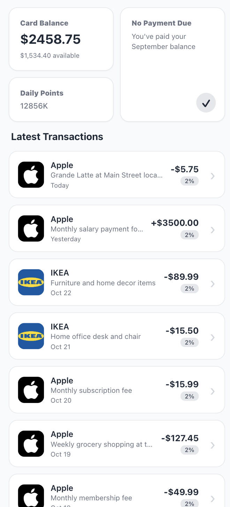
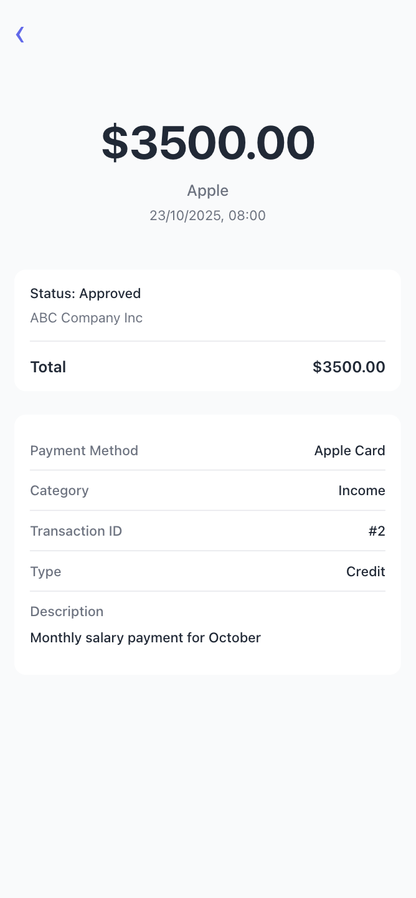

# Wallet App

A modern, mobile-first wallet application built with React and TypeScript. Features a clean interface for managing transactions, tracking daily points, and viewing account balances.

## Features

- **Dashboard View**: Card balance display with available funds, calculated daily points system, and payment status
- **Transaction Management**: Browse latest transactions with company logos, categorization, and detailed information
- **Transaction Details**: Comprehensive view of individual transactions including merchant info, payment method, and descriptions
- **Dynamic Points Calculation**: Season-based points system that calculates rewards based on the current day of the season
- **Responsive Design**: Mobile-optimized interface (max-width: 480px) with smooth scrolling and sticky headers

## Tech Stack

- React 18
- TypeScript
- React Router for navigation
- Vite for build tooling
- CSS3 with custom properties

## Screenshots

### Transactions List


### Transaction Details


## Project Structure

```
src/
├── components/          # Reusable UI components
├── pages/              # Page-level components
├── utils/              # Utility functions (date formatting, points calculation, icon helpers)
├── constants/          # Application constants
└── data/               # Mock data and TypeScript interfaces
```

## Getting Started

1. Install dependencies:
```bash
npm install
```

2. Run development server:
```bash
npm run dev
```

3. Build for production:
```bash
npm run build
```

## Key Components

- **WalletCard**: Displays card balance, daily points, and payment status
- **TransactionList**: Shows all transactions with infinite scroll support
- **TransactionDetail**: Detailed view of individual transactions

## Points System

The daily points system follows a seasonal calculation:
- Day 1 of season: 2 points
- Day 2 of season: 3 points
- Day 3+: 100% of (day-2) points + 60% of (day-1) points, rounded

Points over 1000 are displayed in K format (e.g., 29K).
